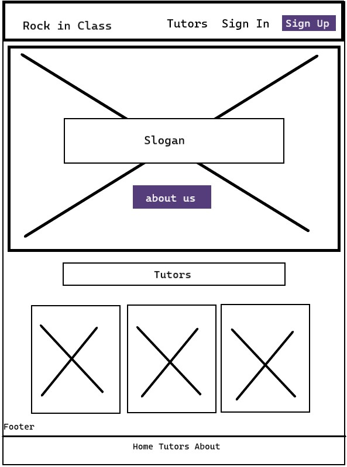
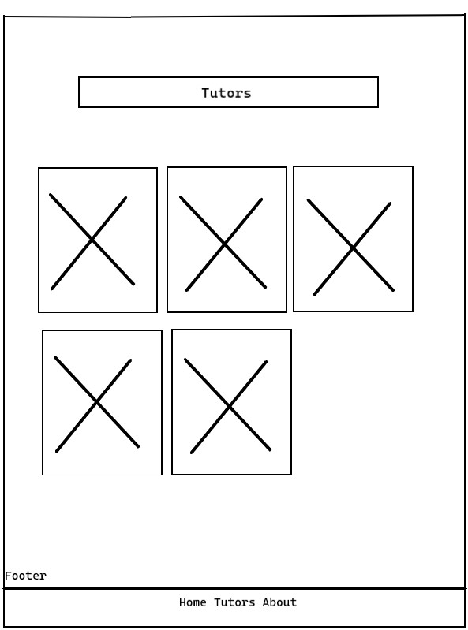
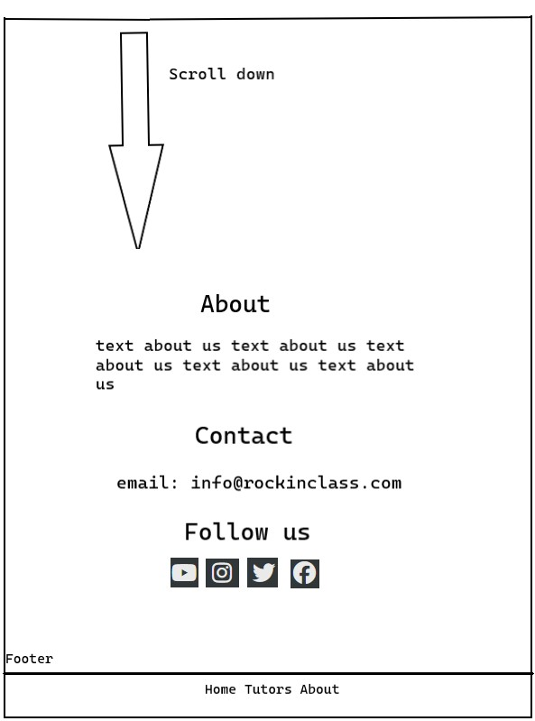
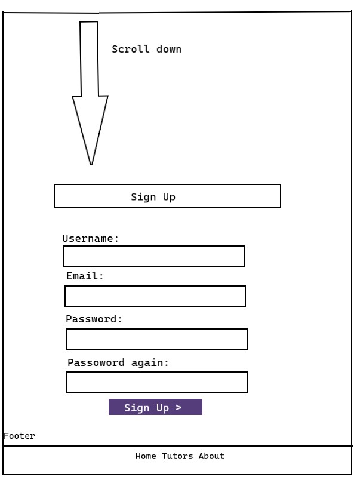
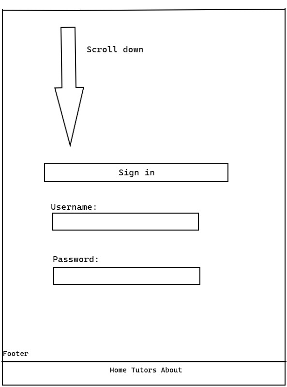
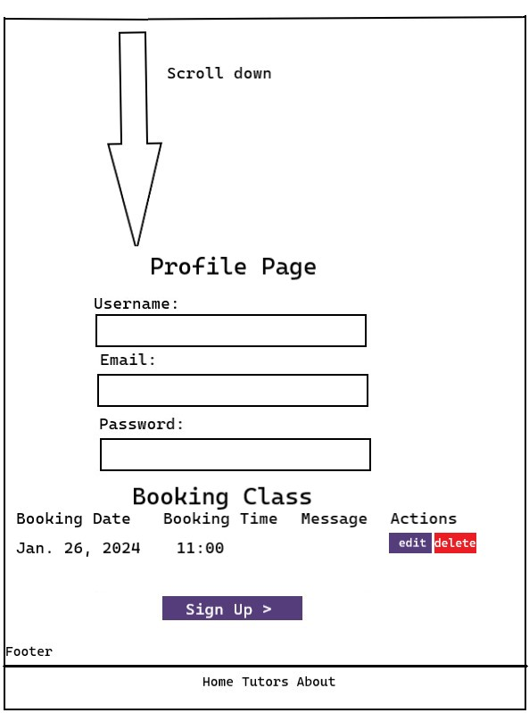

# Rock in Class

Rock in Class, an online music school, serves as a platform where individuals can discover skilled tutors and schedule online music classes with them.

You can view the live site at **[Rock in Class](https://rock-in-class-324f436b36b0.herokuapp.com/).**

## Table of contents

 1. [ UX ](#ux)
 2. [ User Story and Agile Development](#user-story-and-agile)
 3. [ Features ](#features)  
 4. [ Technology used ](#technology-used) 
 5. [ Testing ](#testing)  
 6. [ Bugs ](#bugs)  
 7. [ Deployment](#deployment)
 8. [ Credits](#credits)
 9. [ Content](#content)  
 10. [ Acknowledgements](#acknowledgements)  

 # Ux

 Rock in Class is a conceptual online music school that I conceived and developed a website for. The primary objective of the website is to provide users with the ability to explore available tutors, assess their offerings, and, if satisfied, create an account to schedule music classes.

 ## Design

 Upon discovering the name,  I opted for a modern and minimalistic design approach for the website—something straightforward yet easily navigable.
 ### Colors
 The selected primary colors for the website.
 

 ### Wireframes

 I have created wireframes for the key pages of the site, utilizing Paint3D for the design. The following wireframes for the main pages:

- Home Page

 My objective with this project was to create a minimalist website, designed to showcase the tutors of the school's music department. I purposefully kept the page count to a minimum to prioritize and highlight the essential functionality.
 

- Tutors

 The tutors' wireframe is designed to display their pictures, provide a brief introduction, and detail the type of instrument and genre of music they specialize in.
 

- About

The wireframe for the "About" page includes our contact information and provides a brief overview of who we are.

- Sign up

The signup wireframe is straightforward, requiring only your username, email, password, and password confirmation.

- Sign in

The sign-in wireframe is uncomplicated, requesting only your username and password for authentication.

- Profile

Within the profile wireframe, you can view your bookings, as well as edit (reschedule) or delete them as needed.

# User story and Agile

## User Story

I have established Epics for every essential feature outlined in my scope. Here are the projected user stories associated with each of them:

### Admin management

 - As an **admin** I can **log in to the admin panel** so that **I can manage/see the panel**.

- As an **admin** I can **manage the booking that was made by a student** so that I can **delete or reschedule the appointment**.
- As an **admin** I can **manage the tutor profile in the admin panel** so that I can **delete, update, or add a new tutor**.

### Student account

- As a **student** I can **create an account** so that I can **save my preferences**.

- As a **student** I can **receive a message in the website** so that I am **aware that the registration process is correct**.
- As a **student** I can **log out** so that I **keep my account information secure**.

### Manage booking

- As a **student** I can **log in** so that I can **view my profile or edit it**.

- As a **student** I can **select the date, time and tutor** so that I can **book a class**.

- As a **student** I can **manage my booking** so I can **reschedule or delete the booking**.

#### The user story that is label as Won't have is:
 - As a **student** I can **reset my password** so that I can **change my password if I forget**.

 This might be implemented in the future. Currently, if a student forgets their password, they should reach out to the school for assistance, as indicated on the website.

## Agile development

I initiated this project in a GitHub Projects Page to monitor and organize the anticipated workload. The goal was to outline the expected tasks, categorize them into epics, and further break them down into user stories or manageable tasks. This structured approach aimed to facilitate progress and ensure timely completion of the website.

To see Kanban please click [here](https://github.com/users/Bruna-Andelieri/projects/2/views/1).

# Features

# Technology used

- [HTML](https://html.spec.whatwg.org/) is the standard markup language for documents designed to be displayed in a web browser.

- [CSS](https://www.w3.org/Style/CSS/Overview.en.html) Cascading Style Sheets (CSS) is a stylesheet language used to describe the presentation of a document written in HTML or XML.

- [JavaScript](https://www.javascript.com/) is a programming language that adds interactivity to your website.

- [Bootstrap 5](https://getbootstrap.com/) is a free and open-source CSS framework directed at responsive, mobile-first front-end web development. It contains HTML, CSS and (optionally) Javascript.

- [Python](https://www.python.org/) is an interpreted, high-level, and general-purpose programming language.

- [Django](https://www.djangoproject.com/) is a high-level Python Web framework that encourages rapid development and clean, pragmatic design.

- [ElephantSQL](https://www.elephantsql.com/) is a well-tuned and optimized PostgreSQL databases system.

- [Cloudinary](https://cloudinary.com/) is a cloud service that offers a solution to a web application's entire image management pipeline.

- [Heroku](https://www.heroku.com/) is a platform as a service (PaaS) that enables developers to build, run, and operate applications entirely in the cloud.

# Deployment

Heroku Deployment

- sLog in to Heroku or sign up if you don't have an account.
- On the main Heroku Dashboard page, click 'New' and then 'Create New App.'
- Provide a unique name for your project, and then choose a region closest to you (EU or USA).
- Click on "Create App" to proceed.
- Heroku will create the app and take you to the deploy tab.
- From the new app Settings, click Reveal Config Vars, and set your environment variables:

>`CLOUDINARY_URL`        | insert your own Cloudinary API key here                      
>`DATABASE_URL`          | insert your own ElephantSQL database URL here         
>`DISABLE_COLLECTSTATIC` | 1 (_this is temporary, and can be removed for the final deployment_)
>
>`SECRET_KEY`            | this can be any random secret key   
- Heroku needs two additional files in order to deploy properly(add in your code).

  - requirements.txt
  - Procfile
- Select **Automatic Deployment** from the Heroku app to conect to your Github repository.     

                     

Cloudinary

- Log in to Cloudinary or sign up if you don't have an account.
- Under Primary interest, select Programmable Media for image and video API.
- Optionally, customize your assigned cloud name to something more memorable.
- On your Cloudinary Dashboard, copy your API Environment Variable.
- Ensure to exclude CLOUDINARY_URL= from the API **value**; this part is the **key**.

ElephantSQL Database

- To set up your personal Postgres Database, register with your GitHub account, and then proceed with the following steps:
  - Initiate the process by clicking on Create New Instance to establish a new database.
  - Give a name for the database, typically aligned with the project's name.
  - Opt for the Tiny Turtle (Free) plan.
  - The Tags field can be left empty.
  - Choose the nearest Region and Data Center for your location.
  - Once the database is created, click on its name to access details such as the database URL and Password.

