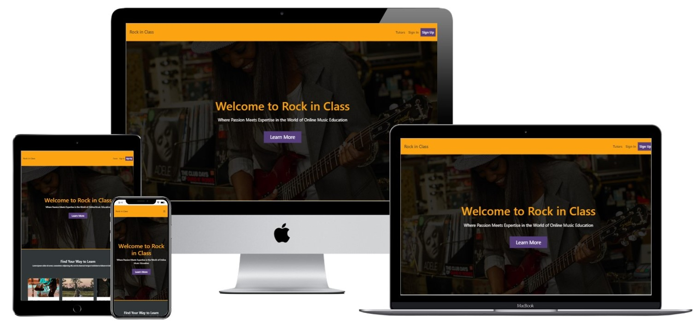
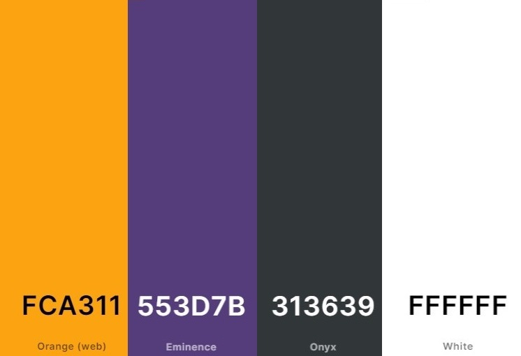

# Rock in Class

Rock in Class, an online music school, serves as a platform where individuals can discover skilled tutors and schedule online music classes with them.

You can view the live site at **[Rock in Class](https://rock-in-class-324f436b36b0.herokuapp.com/).**

## Table of contents

 1. [ UX ](#ux)
 2. [ User Story and Agile Development](#agile)
 3. [ Features ](#features)  
 4. [ Technology used ](#tech) 
 5. [ Testing ](#testing)  
 6. [ Bugs ](#bugs)  
 7. [ Deployment](#deployment)
 8. [ Credits](#credits)
 9. [ Content](#content)  
 10. [ Acknowledgements](#acknowledgements)  

 # Ux design

 Rock in Class is a conceptual online music school that I conceived and developed a website for. The primary objective of the website is to provide users with the ability to explore available tutors, assess their offerings, and, if satisfied, create an account to schedule music classes.

 ### Design

 Upon discovering the name,  I opted for a modern and minimalistic design approach for the website—something straightforward yet easily navigable.
 ### Colors
 The selected primary colors for the website.
 

 ### Wireframes

 I have created wireframes for the key pages of the site, utilizing Balsamiq for the design. The following are the wireframes for the main pages: